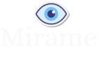
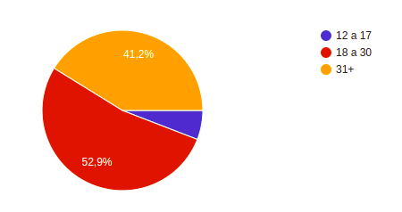
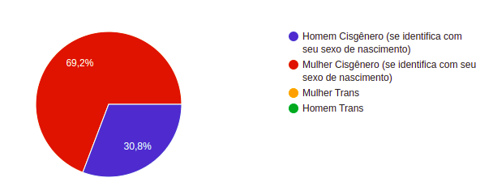
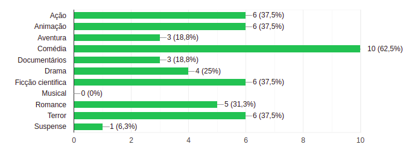
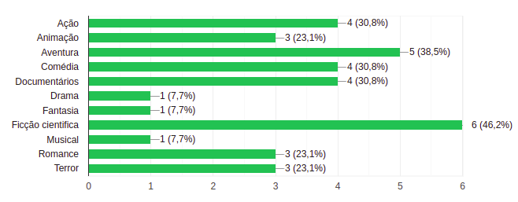
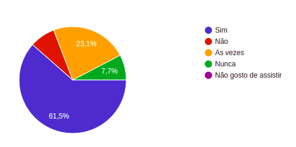
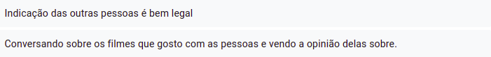
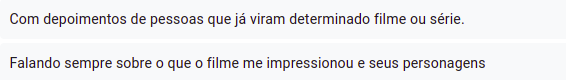

## 📑 Índice

1. [Introdução](#1-introdução)
2. [Resumo do projeto](#2-resumo-do-projeto)
3. [Pesquisa](#3-pesquisa)
4. [Histórias de usuário](#4-histórias-de-usuário)
5. [Funcionalidades](#5-funcionalidades)
6. [Protótipos](#6-protótipos)
7. [Criadoras](#7-criadoras)

 

## 1. Introdução

**Mirame** é o terceiro projeto do bootcamp da **Laboratoria**.  
Trata-se de uma rede social para apaixonados por filmes e séries — um espaço para compartilhar resenhas/reviews, dicas e comentar sobre os últimos lançamentos.

O objetivo do projeto foi desenvolver uma **SPA (Single Page Application)** que permitisse visualizar, postar e interagir com dados, a partir de **histórias de usuários**, garantindo que as funcionalidades atendessem às necessidades reais do público.

 

## 2. Resumo do projeto

Existem redes sociais para todos os tipos de interesse. Pensando nisso, criamos o **Mirame**, uma rede social voltada para fãs de filmes e séries, focada em promover comunicação e interação entre usuários.

A plataforma permite que as experiências de outros usuários ajudem você a decidir **o que assistir a seguir**, por meio de reviews, comentários e recomendações.

🔗 Você pode acessar o Mirame clicando **[AQUI](https://juliabb.github.io/SAP007-social-network/)**

 

### Usuário de teste

Você pode acessar a aplicação utilizando o usuário abaixo ou criar sua própria conta:

| 🍿 | Login |
|:--:|:-----:|
| 👤 | teste@teste.com |
| 🔑 | 123456 |

 

 

## 3. Pesquisa

Realizamos pesquisas com usuários em potencial para entender comportamentos, preferências e expectativas.  
Abaixo estão alguns dos principais resultados:

### Faixa etária

### Gênero / Identidade

### Gênero de filmes favoritos

### Gênero de séries favoritas

### Costuma recomendar filmes/séries?

### Pergunta aberta — O que seria interessante em uma rede social de reviews?

 

## 4. Histórias de usuário

Com base na pesquisa, foram criadas **3 histórias de usuário**, que guiaram o desenvolvimento do projeto:

 

## 5. Funcionalidades

- Cadastro de novos usuários pelo site ou login com Google  
- Login via e-mail e senha ou Google  
- Feed com postagens ordenadas das mais recentes para as mais antigas  
- Visualização de postagens próprias e de outros usuários  
- Criação e exclusão de posts  
- Curtir e remover curtidas (likes)

 

## 6. Protótipos

O protótipo foi desenvolvido no **Figma**.  
Você pode acessá-lo clicando **[AQUI](https://www.figma.com/file/1qKqJVctzn43g0VXAty1fi/Mirame---Social-Network?node-id=0%3A1)**

### Página inicial

### Página de login

### Página de posts

 

## 7. Criadoras

<table>
  <tr>
    <td align="center">
      <a href="https://github.com/juliabb">
         
        
          <b>Julia Benedicto</b> 
          
        
      </a>
    </td>
    <td align="center">
      <a href="https://github.com/vanessavb92">
         
        
          <b>Vanessa Borges</b> 
          
        
      </a>
    </td>
  </tr>
</table>
